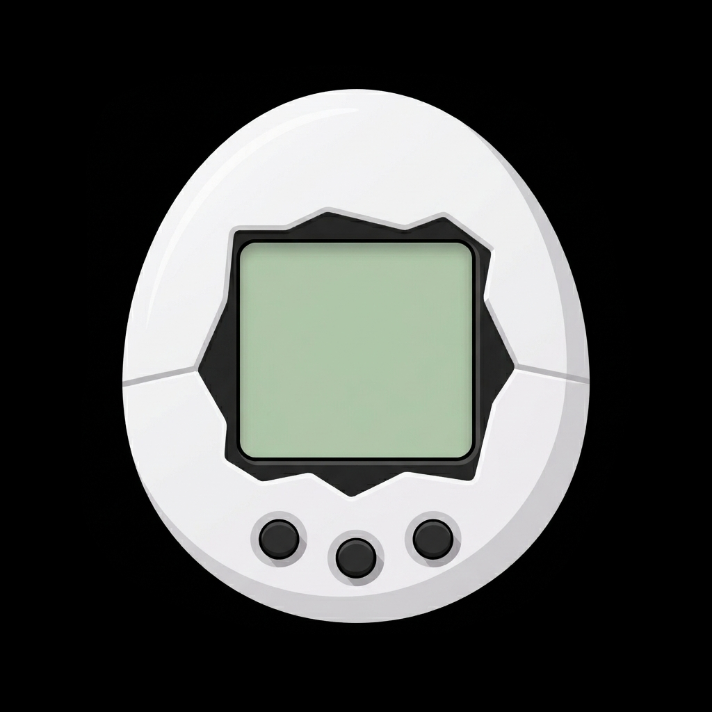

  

<h1 align="center">TamaDroid</h1>

An Android **Tamagotchi P1/P2 emulator** with a home-screen widget, powered by [TamaLib](https://github.com/jcrona/tamalib) via the NDK.

## Demo  
https://youtube.com/shorts/tBHBIujZzkU?si=LUq_GL_dYcSskZIC  

## Install
Download the APK from [GitHub Releases](https://github.com/twelvehouse/TamaDroid/releases).
[Obtainium](https://github.com/ImranR98/Obtainium) is recommended for easy updates.

## ROMs
ROMs aren't bundled — they're Bandai's copyright and can't be dumped from the hardware.
The community uses ROMs transcribed from chip-die photos; the
[Pebble emulator](https://github.com/StefanBauwens/Tamagotchi-Emulator-Pebble) links to P1/P2
ones in the `u12_t` text format this app expects. Import yours in the app (file picker or paste).

## Building
Open in **Android Studio**, or build via `gradlew`. Requires the Android **NDK** and **CMake**.

## Credits
- **[TamaLib](https://github.com/jcrona/tamalib)** by jcrona — the hardware-independent
  Tamagotchi emulator core (C, GPLv2). Reused **unmodified** as the native engine via NDK/JNI.
- **[Tamagotchi-Emulator-Pebble](https://github.com/StefanBauwens/Tamagotchi-Emulator-Pebble)**
  by StefanBauwens — TamaDroid follows its HAL wiring and reuses its LCD image/font assets
  (icons, background frame, `lcd16x2` font).

## License
**GPLv2** — TamaLib is GPLv2 and is linked via the NDK, so TamaDroid as a whole is
distributed under GPLv2. TamaLib's license is at
[`app/src/main/cpp/tamalib/LICENSE`](app/src/main/cpp/tamalib/LICENSE).
The reused Pebble LCD image/font assets carry no stated license — confirm with the author before redistributing.
